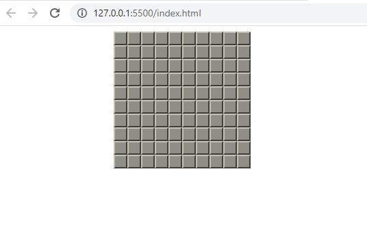
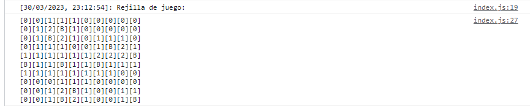

# BUSCAMINAS

Clásico juego del Buscaminas programado con JavaScript



## Incluirlo en una web
---
Se ha de enlazar el fichero index.js, desde el propio servidor o desde https://theguitxo.github.io/buscaminas_js/index.js

Añadir un div con el identificador **buscaminas**

Ejemplo:

```
<script src="https://theguitxo.github.io/buscaminas_js/index.js" type="text/javascript"></script>
<div id="buscaminas" style="width: 200px;"></div>
```

## Opciones
---
El número de minas del juego son 10, pero se puede modificar mediante un atribudo en el div de inserción o en la query string.

Ejemplos:

```
<div id="buscaminas" style="width: 200px;" bombs="15"></div>
```
```
https://theguitxo.github.io/buscaminas_js/?bombs=15
```

Se puede obtener una distribución de las minas en la consola mediante un parámetro en la query string.

Ejemplo:

```
https://theguitxo.github.io/buscaminas_js/?showgrid=1
```


